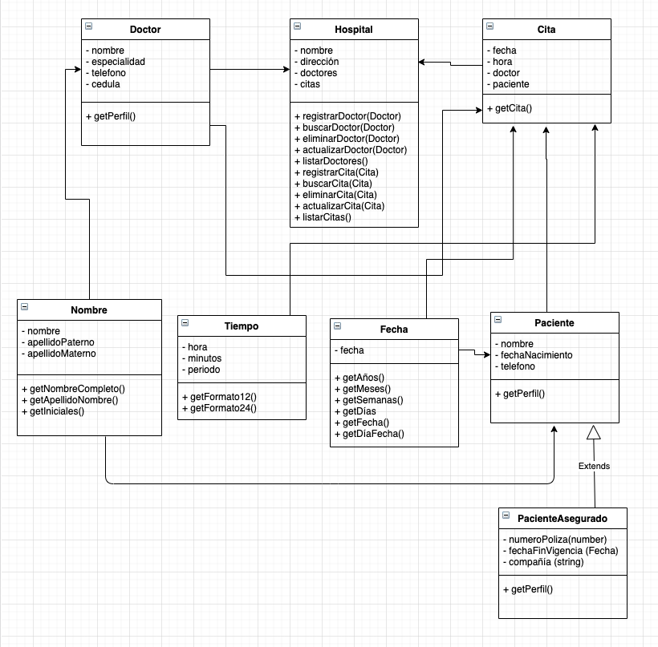

# Conceptos básicos de la POO

## El Hospital

Se requiere desarrollar un sistema web que permita administrar las citas de pacientes. Para este sistema se ha diseñado la siguiente arquitectura la cual deberás implementar utilizando JavaScript

## Descripción de clases
La mayoría de los detalles de las clases para su implementación se pueden obtener del diagrama UML. Sin embargo a continuación se presentan algunas precisiones para algunos métodos o atributos de las clases

### La clase Fecha

- Métodos
  - getAños(). Regresa el número de años desde la fecha indicada hasta el día de hoy. El resultado debe ser un valor entero, sin decimales.
  - getMeses(). Regresa el número de meses que hay desde la fecha indicada hasta el día de hoy. El resultado debe ser un valor entero, sin decimales.
  - getSemanas() Regresa el número de semanas que hay desde la fecha indicada hasta el día de hoy. El resultado debe ser un valor entero, sin decimales.
  - getDias() Regresa el número de días que hay desde la fecha indicada hasta el día de hoy. El resultado debe ser un valor entero, sin decimales.
  - getFecha() Regresa la fecha indicada en el siguiente formato 1/Feb/2020
  - getDiaFecha() Regresa el día de la semana en el que cae la fecha indicada, por ejemplo, Lunes, Martes, etc.

## La clase Tiempo

- Atributos
  - periodo. Se refiere a el periodo del día AM ó PM
- Métodos
  - getFormato12(). Regresa la hora especificada en el formato de 12 horas, por ejemplo 1:24 pm ó 4:55 am
  - getFormato24(). Regresa la hora especificada en el formato de 24 horas, por ejemplo 13:24 ó 17:32

## La clase Nombre

- Métodos
  - getNombreCompleto(). Regresa el nombre completo de la persona, por ejemplo Juan Pérez González
  - getApellidoNombre(). Regresa el nombre completo de la persona, pero iniciando por el apellido, por ejemplo Pérez González Juan
  - getIniciales(). Regresa las iniciales del nombre de la persona, por ejemplo si la persona se llama Juan Pérez González, regresa JPG

## La clase Paciente

- Métodos
  - getPerfil(). Regresa los datos del paciente en el siguiente formato: Juan Pérez González, 1/Feb/2020, 312-345-5667

## La clase Doctor

- Métodos
  - getPerfil(). Regresa los datos del doctor en el siguiente formato: cedula, especialidad, nombre, teléfono

## La clase Cita

- Métodos
  - getPerfil(). Regresa los datos de la cita en el siguiente formato: 1/Feb/2020, 17:23, Dr. Ramírez, Juan Pérez González

## La clase Hospital

- Métodos
  - registrarDoctor(). Agrega un nuevo Doctor
  - listarDoctores(). Imprime un listado de todos los doctores registrados
  - registarCita(). Agrega una nueva Cita
  - listarCitas(). Imprime un listado de todas las citas registradas